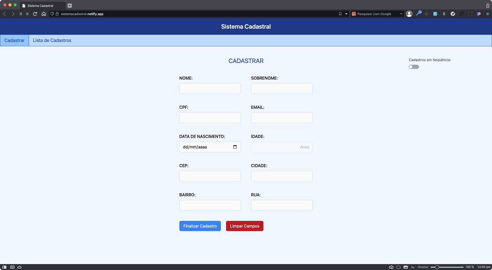
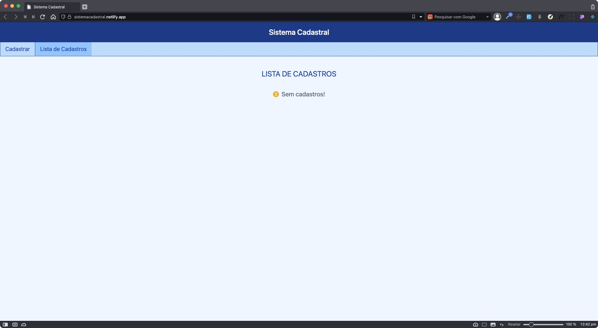
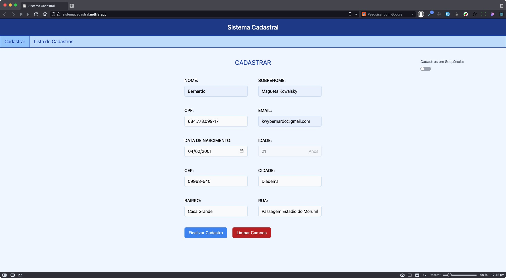
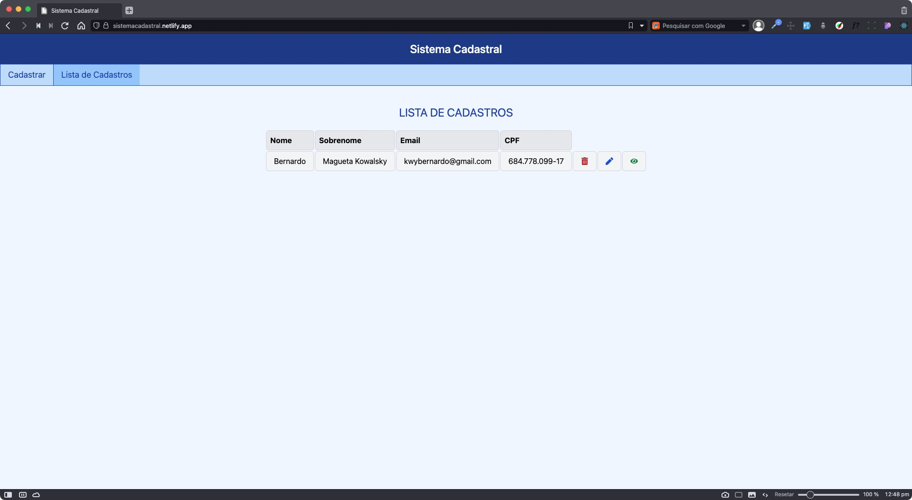
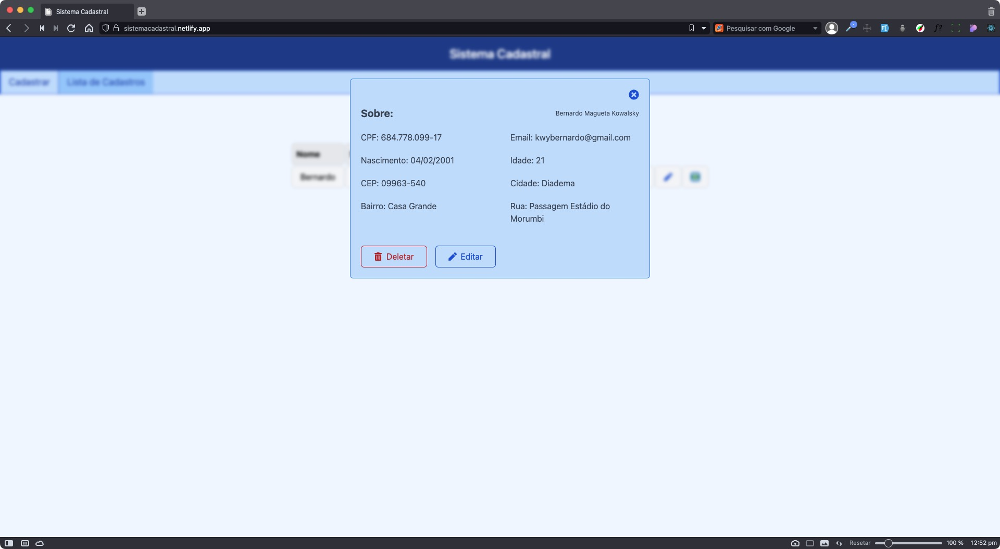

<h1 align="center">Sistema de Cadastro</h1>
<p>Um projeto desenvolvido visando <strong>aperfeiçoar</strong> conceitos relacionados ao Front-End. <strong>Desenvolvido</strong> com <br> ReactJS e Tailwind</p>

<p align="center">


</p>

<p align="center">
  <a href="#nike-store">
    
  </a>
</p>

## Funcionalidades
- Dados guardados no localStorage
- CRUD
- Hooks para servir o CRUD
- A chave de armazenamento do cadastro é o CPF, fazendo com que seja uma chave única

## Instalação

Para inicializar o projeto localmente siga os passos descritos abaixo:

Primeiro, clone o repositório:
```
git clone https://github.com/BeKowalsky/SistemaCadastral.git
```

Acesse o repositório utilizando o seguinte comando
```
cd SistemaCadastral
```

Faça a instalação das dependências:
```
npm install
```

Para executar a aplicação
```
npm start
```

## Aplicação

A aplicação está hospedada na plataforma da [Netlify](https://www.netlify.com/), clique [aqui](https://sistemacadastral.netlify.app) para acessar.

## Previews
<p align="center">
  <h3>Tela de cadastro</h3>
  <a href="#nike-store">
    
  </a>
  
  <h3>Listagem de cadastros vazia</h3>
  <a href="#nike-store">
    
  </a>
  
  <h3>Simulação de cadastro</h3>
  <a href="#nike-store">
    
  </a>
  
   <h3>Listagem de cadastros</h3>
  <a href="#nike-store">
    
  </a>
  
  <h3>Informações do cadastro</h3>
  <a href="#nike-store">
    
  </a>
</p>

## Contato

Qualquer dúvida ou feedback estarei disponível em qualquer uma das redes sociais abaixo:

<div align="center">
  <a href="https://www.linkedin.com/in/bekowa/" target="_blank"></a>
  <a href = "mailto:kwybernardo@gmail.com"></a>
</div>
